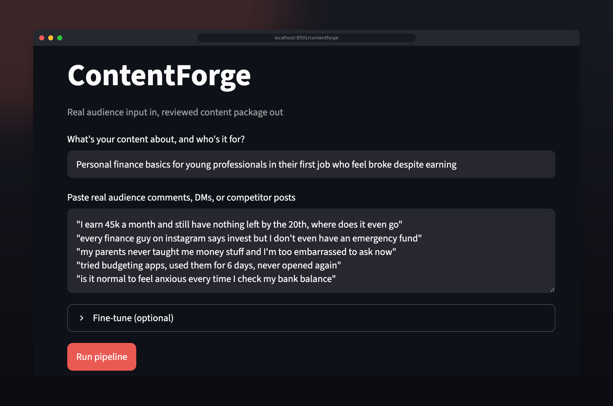
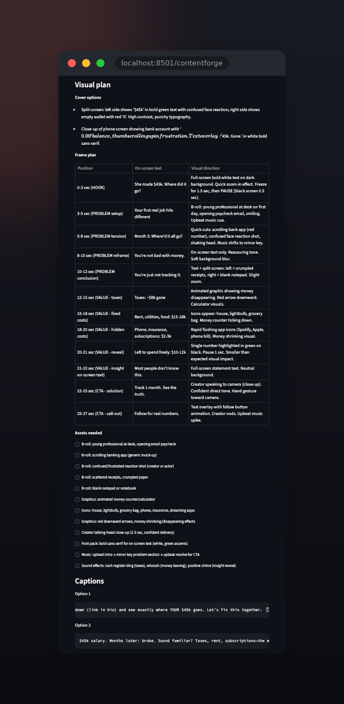
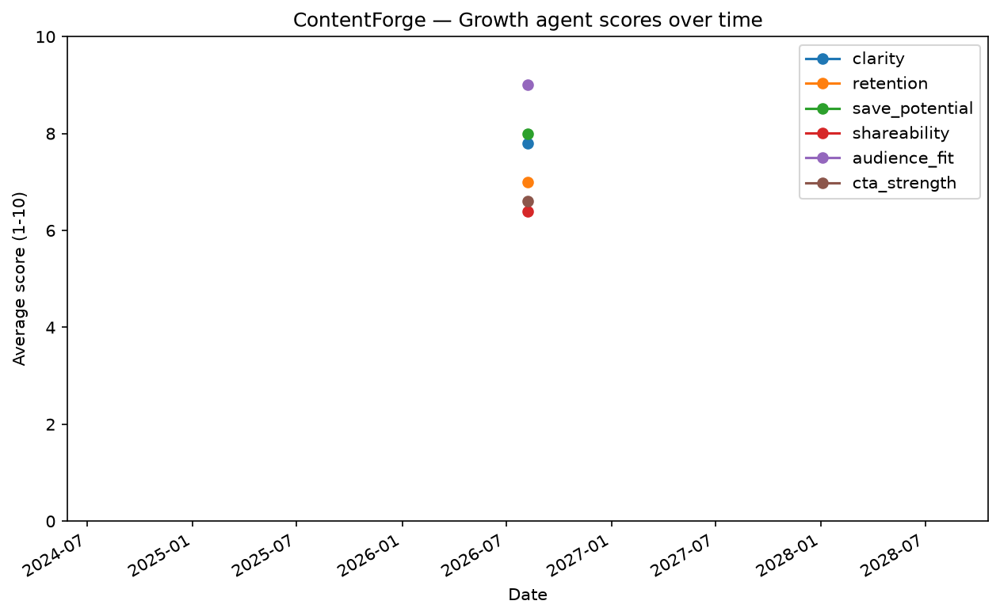
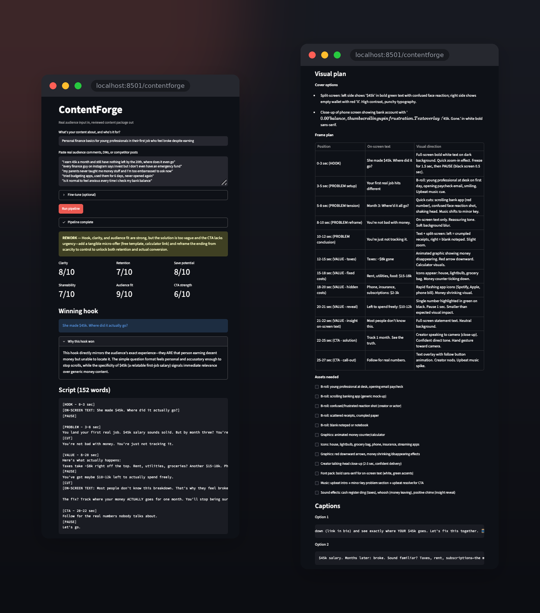

# ContentForge


A 5-agent LLM pipeline that turns real audience input into a ready-to-post piece
of social media content, and scores its own output for quality before you publish.

Built on the Anthropic API (`claude-haiku-4-5`) with a Streamlit front end.



## The problem

Making good short-form content is not one task, it's five: figuring out what's
actually worth saying, finding an angle that stops the scroll, writing the thing,
deciding what it looks like on screen, and knowing whether it will travel. Ask a
single LLM prompt to do all five and you get a mediocre average of all of them.

ContentForge splits the work across five specialised agents, each with its own
prompt template and its own narrow job, and pipes the structured output of one
into the next.

One rule holds the whole thing together: the system never invents audience data.
You paste real comments, DMs, or competitor posts, and every agent works from
that. Human truth in, machine craft applied, human judgment at the end.

If you're not sure what to paste, there's a "Suggest example comments" button
that generates a few illustrative examples based on your niche, clearly
labeled as AI-generated, not real data, to help you see the shape of a good
input before you replace it with the real thing.

## The pipeline

```
real audience input -> Research -> Hook -> Script -> Visual -> Growth -> scored content
```

| # | Agent | Job | Consumes | Produces |
|---|-----------|--------------------------------------------------------------|--------------------|-------------------|
| 1 | Research  | Extract pain points and angles from real audience material    | audience material  | research brief    |
| 2 | Hook      | Generate and rank opening lines that earn the first 3 seconds | research brief     | ranked hooks      |
| 3 | Script    | Write the full post/script around the winning hook            | brief + hook       | script            |
| 4 | Visual    | Specify shots, captions, on-screen text, and pacing           | script             | visual plan       |
| 5 | Growth    | Score the result and suggest concrete improvements            | everything upstream| quality score     |

Every agent returns **structured JSON**, so each stage is inspectable on its own.
You can see exactly where a weak post went wrong instead of re-rolling the whole
thing.



## Quality scoring

The Growth agent is the differentiator. Rather than ending at "here's your post,"
the pipeline closes the loop: it grades the output against explicit criteria
(hook strength, clarity, payoff, platform fit) and returns a score plus specific
revision notes. That makes the system measurable. You can A/B a prompt change and
see whether the score moves.

It also has teeth. On its very first full run, the Growth agent scored the
pipeline's own output and refused to approve it: final call REWORK, with specific
notes on the CTA. The quality gate actually gates.

## Concurrency

The 5-agent chain within one run is sequential by nature, each stage needs
the previous stage's output, so parallelizing it wouldn't help (Amdahl's
law: you can't speed up work that has to happen in order).

The real opportunity is running multiple independent pipeline runs at once.
Benchmarked 3 separate jobs: 130.0s running one after another, 51.4s running
concurrently with asyncio.gather. 2.53x speedup.

## Reliability

Every API call goes through a token-bucket rate limiter before it's sent,
so the pipeline slows itself down proactively instead of waiting to get
rejected. Exponential backoff remains as a safety net underneath it.

All internal events (agent calls, cache hits and misses, retries) are
logged with timestamps to logs/contentforge.log, not just printed to a
terminal that disappears when you close it.

## Analytics

Every run logs to a local SQLite database alongside the JSON files. A small
pandas script (scripts/analyze_history.py) reads it back for real analysis.

Ran 5 varied pipeline calls across different niches. Average scores: clarity
7.8, retention 7.0, save potential 8.0, shareability 6.4, audience fit 9.0,
CTA strength 6.6. Average latency: 47.18s uncached vs 0.99s cached, about
47x faster on a cache hit, measured from the database.



## Project layout

```
app.py                    Streamlit UI
Dockerfile, docker-compose.yml   Container build + run
src/
  agents/                 One module per agent, all inheriting a shared BaseAgent
  prompts/                Prompt templates as .txt files, never inlined in code
  models.py                Dataclasses for each agent's output
  pipeline.py               Chains the five agents, saves every run
  cache.py                  Content-addressed response cache
  rate_limiter.py           Token-bucket rate limiter for API calls
  logging_config.py         Console + rotating file log setup
  history.py                SQLite run history (scores, latency, per run)
scripts/
  benchmark_concurrency.py   Sequential vs. concurrent timing
  analyze_history.py         pandas/matplotlib analysis of history.db
tests/                    pytest suite (parsing, pipeline, cache, history, ...)
examples/                 Saved pipeline runs with full inputs and outputs
```

## Setup

### Run with Docker

```bash
cp .env.example .env      # then add your real key
docker compose up --build
```

Open http://localhost:8501. The API key comes in at container *start* time via
`env_file` in `docker-compose.yml`, not baked into the image at build time.

### Manual setup (for development)

```bash
python -m venv venv && source venv/bin/activate
pip install -r requirements.txt
cp .env.example .env      # then add your real key
streamlit run app.py
```

Config is read from `.env` via `python-dotenv`. `.env` is gitignored, so API keys
are never hardcoded or committed.

For linting/type-checking/tests, install `requirements-dev.txt` instead (it
pulls in `requirements.txt` too); for `scripts/analyze_history.py`, install
`requirements-analysis.txt`.

## Status

v1.0.0 shipped and containerized. Actively extending into full production:
style extraction, voiceover, posters, and video assembly are next.

## Full run



## Roadmap

- [x] Phase 1: Setup, repo, prompt templates, API working
- [x] Phase 2: BaseAgent with retry logic + first working agent
- [x] Phase 3: Clean JSON outputs from every agent + tests
- [x] Phase 4: Chain all 5 agents into one pipeline
- [x] Phase 5: Streamlit UI so it's usable without a terminal
- [x] Phase 6: CI with tests, lint, and type checks on every push
- [x] Phase 7: Response caching so repeat runs cost nothing
- [x] Phase 8: Parallelize independent stages, measure speedup
- [x] Phase 9: Client-side rate limiting + proper logging
- [x] Phase 10: SQLite run history + score analytics
- [x] Phase 11: Docker + final docs, then v1.0.0
- [x] Phase 12: Style extraction from a reference image or PDF into a shared style kit
- [x] Phase 13: Face/no-face toggle + AI voiceover (cloned or generic voice)
- [ ] Phase 14: Poster generator using the shared style kit
- [ ] Phase 15: Video editor foundation, FFmpeg assembly with a background job queue
- [ ] Phase 16: Video editor, real footage assembly synced to voice and timing
- [ ] Phase 17: Quality gates for posters, voice, and video, then v2.0.0

Building this in phases and committing as I go, so the history shows how it
actually came together. The plan grew mid-project once the basics worked. The
later phases harden it into something closer to production software. Phase 11
shipped v1.0.0; phases 12 onward extend it from a content planning tool into a
full production pipeline with style, voice, posters, and assembled video.